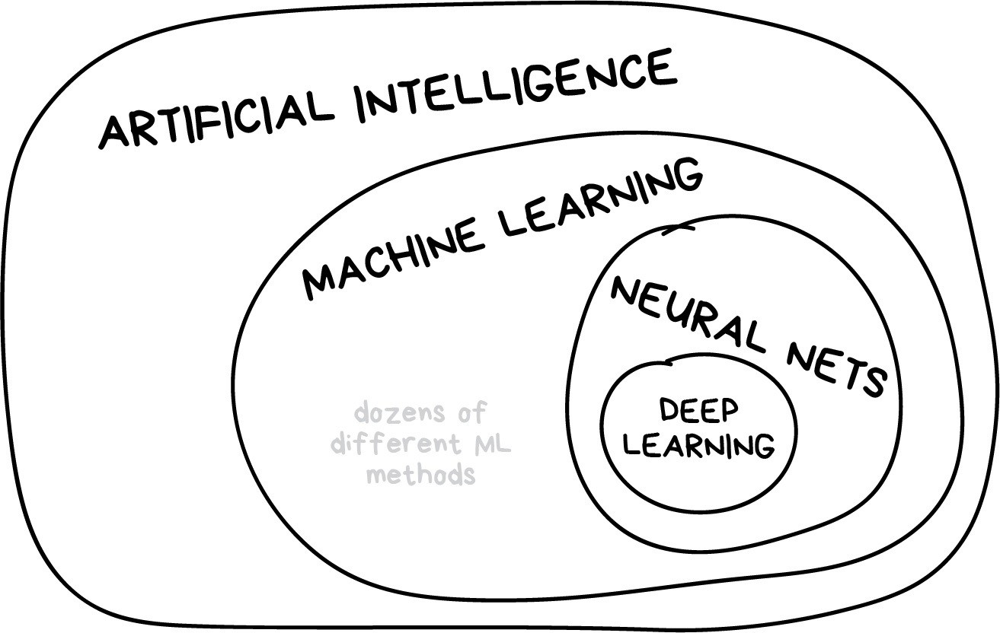
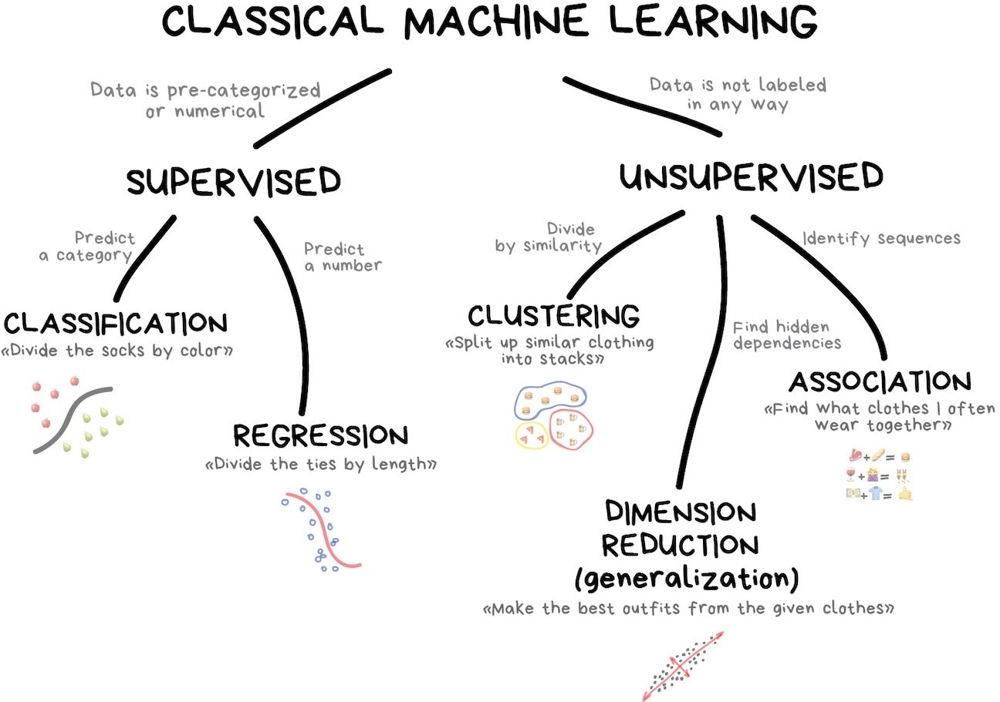
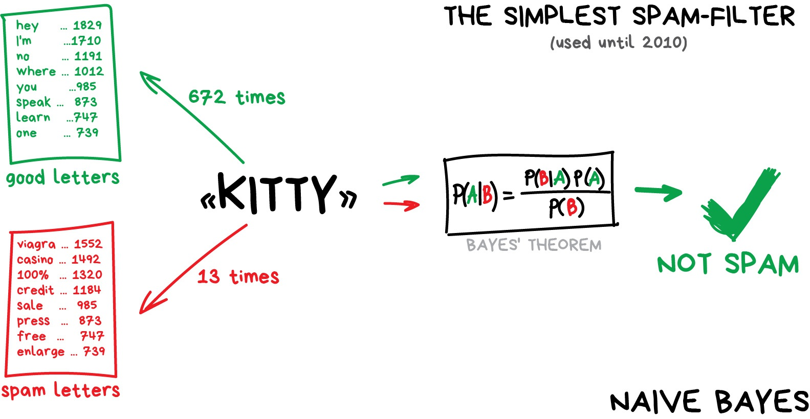
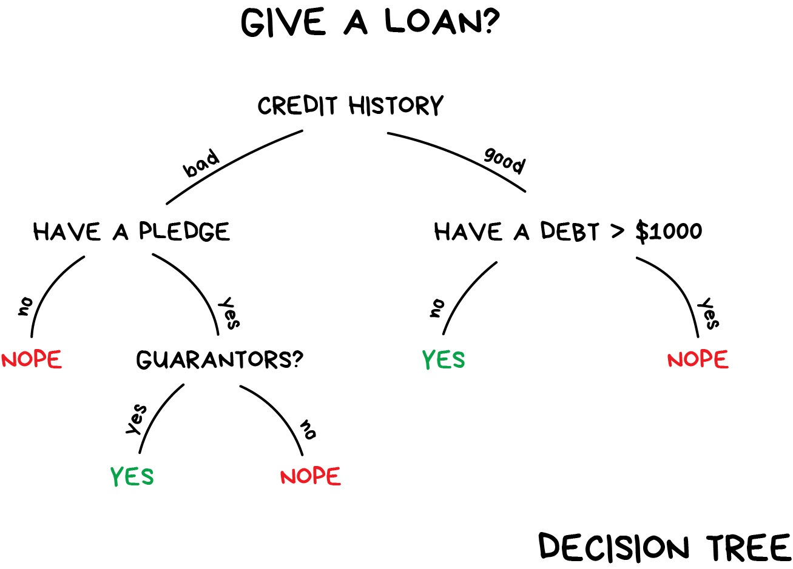

```{r setup, include=FALSE}
source(here::here("R/00-xaringan-knitr-setup.R"))
```

## Antes de empezar

- Repositorio del curso https://github.com/jbkunst/intro-machine-learning 
encontraremos el programa, clases, datos.

- La bibliografía principal será _Tidy modelling with R_ https://www.tmwr.org/, 
nos servirá como guía en nuestro programa.

- Como introducción utilizaremos el blogpost [Machine Learning for Everyone](https://vas3k.com/blog/machine_learning/).

---

## R y Rstudio (repaso)

R es el lenguaje de programación que utilizaremos (como C++, python) y RStudio es un IDE para
R (como PyCharm para python por ejemplo).

Para utilizar R se puede hacer, en un principio, de dos maneras:

1. Instalar R y RStuiod en tu PC.
2. Utilizar desde la nube con https://rstudio.cloud/.

Más detalles en las diferencias en https://github.com/rivaquiroga/taller-r-doctorado-educacion-2022/blob/master/preparacion-instalacion.md

Para conocer un poco más de RStudio https://github.com/rivaquiroga/RLadies-Santiago/blob/master/primeros_pasos_en_R.md.

Cada uno de los links son de autoría de [Riva Quiroga](https://rivaquiroga.cl/).

---

## Inteligencia artificial

La inteligencia artificial es, en ciencias de la computación, la disciplina que intenta replicar y desarrollar la inteligencia y sus procesos implícitos a través de computadoras.

```{r out.width="60%", fig.align='center', echo=FALSE}

```

---

## Machine learning

El aprendizaje de máquinas es una rama de la inteligencia artificial, cuyo objetivo es desarrollar técnicas que permitan que las computadoras _aprendan_.

```{r out.width="55%", fig.align='center', echo=FALSE}

```

---

## Clasificación

https://vas3k.com/blog/machine_learning/#scroll70.

Separar objetos basado en atributos conocidos de antemano. Usado para:

* Filtro Spam.
* Detección de Lenguaje.
* Detección de fraude.
* Venta de productos financieros.

Algoritmos populares: Arbol de decisión, Regresión logística, 
Naive Bayes, KNN (K-Nearest Neighbours).


---

## Naive Bayes

```{r out.width="70%", fig.align='center', echo=FALSE}

```

<small>Suponga que se tienen 1.000 _good_ y 1.000 _spam_. Calcule probabilidad
de que sea Spam dado que contiene la palabra Kitty.</small>


---

## Naive Bayes (cont.)

Suponga que se tienen 1.000 _good_ y 1.000 _spam_. Calcule probabilidad
de que sea Spam dado que contiene la palabra Kitty.

$$\begin{aligned} 
 \Pr(Spam|Kitty) &= \frac{\Pr(Kitty|Spam) \Pr(Spam)}{\Pr(Kitty)} \\ 
                 &= \frac{ \frac{13}{1000} \times \frac{1000}{1000+1000}}{\frac{672 + 13}{1000+1000}}   \\
                 &= 0.0189781
\end{aligned}$$


---

## Árbol de Decisión (Decision tree)

[Una introducción visual al machine learning](http://www.r2d3.us/visual-intro-to-machine-learning-part-1/).

```{r out.width="70%", fig.align='center', echo=FALSE}

```


---

`r flipbookr::chunk_reveal("arbol", title = "## Árbol de Decisión en R", widths = c(1, 1), chunk_options = "fig.height = 2.7, fig.width = 3")`

```{r arbol, include = FALSE}
library(tidyverse) 
library(partykit) 

ruta <- "https://raw.githubusercontent.com/jadeyee/r2d3-part-1-data/master/part_1_data.csv"

datos <- readr::read_csv(ruta, skip = 2)

datos <- datos |> 
  mutate(in_sf = factor(ifelse(in_sf == 1, "SF", "NY")))

arbol <- ctree(in_sf ~ ., data = datos)

arbol

# siguiente slide
# plot(arbol) 
```

---

## Árbol de Decisión en R (cont.)

```{r, echo=FALSE}
plot(arbol, gp = gpar(fontsize = 8))
```

---

## Árbol de Decisión (cont.)

Existen muchos tipos de algoritmos de árboles.

Básicamente se diferencias en:

* La forma de seleccionar cual es la variable
que mejor separa los subconjuntos (etiquetas/variable respuesta) y,
* Como se obtiene el límite de dicha variable.


Algoritmos conocidos son CART, CHAID, [C4.5](https://en.wikipedia.org/wiki/C4.5_algorithm),
C5.0, Conditional Inference Trees.


---

## Más información sobre Machine Learning

- [Tidy Modeling with R](https://www.tmwr.org/).

- [Machine Learning for Everyone](https://vas3k.com/blog/machine_learning/).


